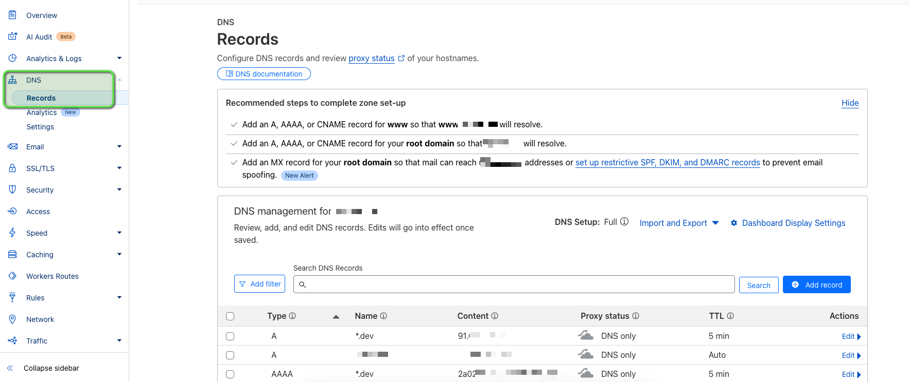
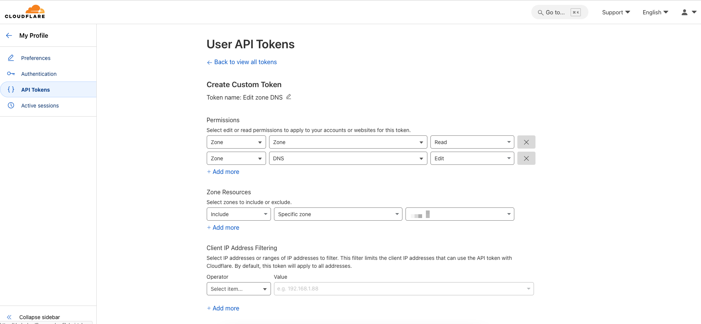
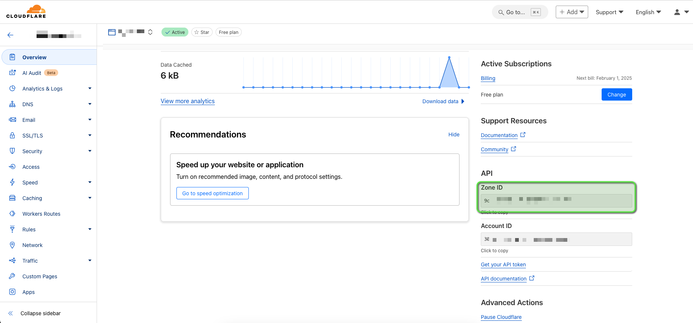

# Cloudflare DDNS and Traefik Configuration

This repository contains configuration files and instructions for setting up a Cloudflare Dynamic DNS (DDNS) service and a Traefik reverse proxy with Let's Encrypt SSL/TLS support.

---

## Table of Contents

1. [Overview](#overview)
2. [Requirements](#requirements)
3. [Configuration Files](#configuration-files)
    - [config.ddns.json](#configddnsjson)
    - [compose.yml](#composeyml)
    - [.env.dist](#envdist)
    - [acme.json](#acmejson)
4. [Usage](#usage)
    - [Environment Variables](#environment-variables)
    - [Running the Services](#running-the-services)
5. [Dashboard Access](#dashboard-access)
6. [Updating Configuration](#updating-configuration)
7. [Troubleshooting](#troubleshooting)
8. [Makefile Usage](#makefile-usage)
8. [Maintenance and Updates](#maintenance-and-updates)
9. [Security Considerations](#security-considerations)
10. [Support](#support)

---

## Overview

This setup provides:

- **Dynamic DNS updates**: Automatically updates A and AAAA records in Cloudflare.
- **Reverse proxy management**: Handles routing and SSL/TLS certificates with Traefik.
- **Automatic SSL certificate renewal**: Uses Let's Encrypt with DNS-01 challenges.

---

## Requirements

- Docker and Docker Compose installed.
- A Cloudflare account with an API token that has DNS edit permissions.
- Domain names managed through Cloudflare.

---

## Configuration Files

### `config.ddns.json`

Configures the Cloudflare DDNS updater.

```json
{
  "cloudflare": [
    {
      "authentication": {
        "api_token": "your-cloudflare-api-token"
      },
      "zone_id": "your-cloudflare-zone-id",
      "subdomains": [
        {
          "name": "*.your-subdomain",
          "proxied": false
        }
      ]
    }
  ],
  "a": true,
  "aaaa": true,
  "purgeUnknownRecords": true,
  "ttl": 300
}
```

- **`zone_id`**: The Cloudflare zone identifier for your domain.
- **`subdomains`**: List of subdomains to update dynamically.

### `compose.yml`

Defines Docker Compose services for DDNS and Traefik.

```yaml
services:
  ddns:
    image: timothyjmiller/cloudflare-ddns:latest
    container_name: ddns
    network_mode: 'host'
    environment:
      - PUID=1000
      - PGID=1000
    volumes:
      - ./config.ddns.json:/config.json:ro
    restart: unless-stopped

  traefik:
    image: traefik:latest
    container_name: traefik
    ports:
      - "80:80"
      - "443:443"
    volumes:
      - /var/run/docker.sock:/var/run/docker.sock:ro
      - ./certs:/letsencrypt
    command:
      - "--api=true"
      - "--api.dashboard=true"
      - "--entrypoints.web.address=:80"
      - "--entrypoints.websecure.address=:443"
      - "--certificatesresolvers.letsencrypt.acme.dnschallenge=true"
      - "--certificatesresolvers.letsencrypt.acme.storage=/letsencrypt/acme.json"
      - "--certificatesResolvers.letsencrypt.acme.dnschallenge.provider=cloudflare"
      - "--certificatesResolvers.letsencrypt.acme.dnschallenge.resolvers=1.1.1.1:53,1.0.0.1:53"
    environment:
      - CF_DNS_API_TOKEN=${CF_DNS_API_TOKEN}
      - CERT_MAIL=${CERT_MAIL}
    restart: unless-stopped
```

### `.env.dist`

A template environment file for storing sensitive variables.

```env
# Cloudflare
CF_DNS_API_TOKEN=your-cloudflare-api-token
CERT_MAIL=your-email@example.com

# Let's Encrypt
MAIN_DOMAIN=your-main-domain.com
SANS_DOMAIN=*.your-main-domain.com

# Dashboard
DASHBOARD_DOMAIN=traefik.localhost
DASHBOARD_ENABLED=true

# WhoAmI Sample
WHOAMI_DOMAIN=whoami.localhost
```

- **`CF_DNS_API_TOKEN`**: Your Cloudflare API token with DNS permissions.
- **`CERT_MAIL`**: Email address for Let's Encrypt notifications.
- **`MAIN_DOMAIN`**: The primary domain for the SSL certificate.
- **`SANS_DOMAIN`**: Additional domains (wildcards) for the SSL certificate.
- **`DASHBOARD_ENABLED`**: Enable Traefik dashboard (default: `false`).
- **`DASHBOARD_DOMAIN`**: URL of the traefik dashboard, if `DASHBOARD_ENABLED=true`
- **`WHOAMI_DOMAIN`**: URL of the whoami service, for demo purposes

### `acme.json`

This file stores SSL/TLS certificates managed by Traefik. Will be created automatically. Ensure it has restricted permissions after creation:

```bash
chmod 600 acme.json
```

---

## Usage

### Environment Variables

1. Copy `.env.dist` to `.env`:

   ```bash
   cp .env.dist .env
   ```

2. Edit `.env` to provide the required values.

### Running the Services

1. Start the Docker Compose services:

   ```bash
   docker-compose up -d
   ```

2. Check if the services are running:

   ```bash
   docker ps
   ```

---

## Dashboard Access

1. Ensure Traefik's dashboard is enabled in the `compose.yml` file under the `command` section.
2. Visit the dashboard using your domain:

   ```
   https://your-domain/dashboard
   ```

---

## Updating Configuration

### For `config.ddns.json`

- Modify the subdomains or zone ID.
- Restart the DDNS service:

  ```bash
  docker-compose restart ddns
  ```

### For `compose.yml`

- Make necessary updates to the services or environment variables.
- Rebuild and restart:

  ```bash
  docker-compose up -d --build
  ```

---

## Troubleshooting

### DNS Updates Not Reflecting

- Verify the API token and `zone_id` in `config.ddns.json`.
- Check DDNS logs:

  ```bash
  docker logs ddns
  ```

### SSL Certificates Not Issued

- Ensure DNS records are correctly set up.
- Check Traefik logs:

  ```bash
  docker logs traefik
  ```

---

## Makefile Usage
The `Makefile` provides convenient commands to manage the Docker Compose services. Below are the available targets and their usage:  

### Targets
- `start-ddns`: Starts the Cloudflare DDNS service.
- `start-traefik`: Starts the Traefik service.
- `start`: Starts both the DDNS and Traefik services, including whoami sample.
- `start-dev`: Starts both the DDNS and Traefik services
- `stop`: Stops all running services.
- `down`: Stops and removes all services.

### Usage
To use the `Makefile` targets, run the following commands in your terminal:  
  
`make <target>`, e.g., `make start` to start both services and the sample application.

## Maintenance and Updates

### Updating Docker Images

1. Pull the latest images:

   ```bash
   docker-compose pull
   ```

2. Restart the services:

   ```bash
   docker-compose up -d
   ```

### Backing Up Configuration

- Backup important files:
  - `.env`
  - `config.ddns.json`
  - `acme.json`
  - `compose.yml`

---

## Security Considerations

- **File Permissions**: Restrict access to sensitive files like `.env`, `config.ddns.json`, and `acme.json`.
- **API Tokens**: Use scoped API tokens with minimal permissions.
- **Regular Updates**: Keep Docker images and configurations up-to-date.

---

## Support

For support:

- Open an issue on the repository.
- Refer to [Traefik Documentation](https://doc.traefik.io/traefik/).
- Refer to [Cloudflare API Documentation](https://developers.cloudflare.com/api/).

---

## Cloudflare Setup

### Sample config.ddns.json

```json
{
  "cloudflare": [
    {
      "authentication": {
        "api_token": "XXXXXXXXXXXXXXXXXXXXXXXXXXXXXXXXXXXXXXXX"
      },
      "zone_id": "XXXXXXXXXXXXXXXX",
      "subdomains": [
        {
          "name": "*.dev",
          "proxied": false
        }
      ]
    }
  ],
  "a": true,
  "aaaa": true,
  "purgeUnknownRecords": true,
  "ttl": 300
}
```

leading to the following DNS records:


### API Token
The Cloudflare API token can be obtained from the Cloudflare dashboard under `My Profile` -> `API Tokens` -> `Create Token`.
(https://dash.cloudflare.com/profile/api-tokens)


### Zone ID
The zone ID can be found in the Cloudflare dashboard under the domain's `Overview` tab.



Feel free to contribute or suggest improvements!
